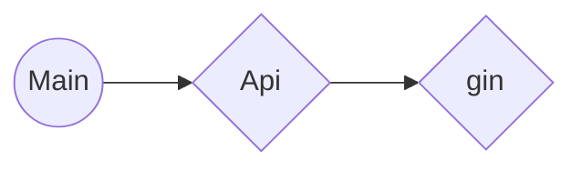
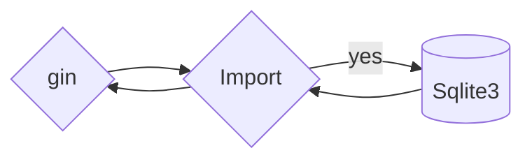
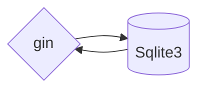
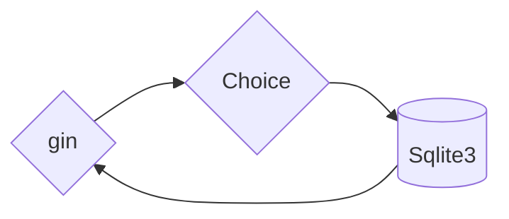

## 💻 About

- For a more secure network environment, self built Ca and self issued SSL certificate
- **Tip**  \[ [ssleye](https://www.ssleye.com/self_sign.html) ] \[ [myssl](https://myssl.com/create_test_cert.html) ]\[ [sslchecker](https://www.sslchecker.com/csr/self_signed) ] **online**

## ⚠️ danger

- If the same root certificate name exists in the database, the certificate in the database will be exported
- If the same service certificate name and (IP | Domain) exist in the database, the certificate in the database will be exported
- The domain name verification method uses setting temporary hosts to bypass DNS

## 🟡  Web UI


## ☂️ How to use

#### Run

```bash
./sslt
# Port 8081
```

#### Help

```bash
➜  ~ ./sslt -help
 -------------------------------
   _____   _____  .      _______
  (       (      /     '   /   
   `--.    `--.  |         |   
      |       |  |         |   
 \___.'  \___.'  /---/     /   
 ----------------------     
Usage of sslt:
  -api
        sslt api
  -c string
        Specified Country (default "US")
  -h    Display help information
  -help
        Display help information
  -host string
        Specified domain name (default "localhost")
  -p string
        Specified encryption protocol (default "rsa")
  -r string
        Import CA (default "sslt/ca.pem")
  -rc string
        Specified Root CommonName (default "GTS Root R1")
  -rk string
        Import CA Key (default "sslt/ca.key.pe")
  -rlc string
        Specified Root Locality
  -rna string
        Specified Root NotAfter
  -ro string
        Specified Root Organization (default "Google Trust Services LLC")
  -rou string
        Specified Root OrganizationalUnit
  -rpc string
        Specified Root PostalCode
  -rpr string
        Specified Root Province
  -rsn string
        Specified Root SerialNumber
  -rst string
        Specified Root StreetAddress
  -s string
        Import Cert CA (default "sslt/server.pem")
  -sc string
        Specified Server CommonName (default "GTS CA 1C3")
  -sk string
        Import Cert CA Key (default "sslt/server.key.pe")
  -slc string
        Specified Server Locality
  -sna string
        Specified Server NotAfter
  -so string
        Specified Server Organization (default "Google Trust Services LLC")
  -sou string
        Specified Server OrganizationalUnit
  -spc string
        Specified Server PostalCode
  -spr string
        Specified Server Province
  -ssn string
        Specified Server SerialNumber
  -sst string
        Specified Server StreetAddress
  -v    sslt version
 -------------------------------
```

## 🟠 Task
- [ ] Api
  - [x] Web API
    - [ ] List All Certificates
      - [ ] Sqllite
        - [ ] **TODO** QuireAll
        - [x] CaInquire
        - [x] CaAdd
    - [x] Home
    - [x] new
    - [x] import
    - [x] help
  
- [ ] Vue web
- [x] Import Certificate
- [x] Save to sqlite3
- [x] Generate a certificate

## 🟢 Architecture

#### /




#### /import




#### /list




#### /new


## 😊 Thanks

\[ [shaneutt](https://gist.github.com/shaneutt/5e1995295cff6721c89a71d13a71c251) ]  \[  [AndroidOL](https://post.m.smzdm.com/p/715145/) ]  \[ [I3estD4rkKn1ght](https://github.com/I3estD4rkKn1ght) ]